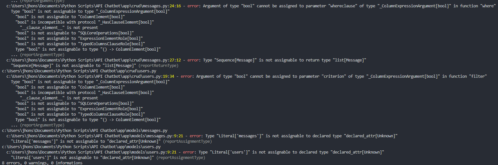

# OpenAI Integration

Este es un proyecto web desarrollado con FastAPI, con el proposito de integrarse via API a servicios de OpenAI.

## Explicacion Proyecto

Se realizaron dos tablas, relacionadas mediante una llave foranea con el fin de evitar la incosistencia entre los usuarios y los mensajes (por ejemplo que un mensaje tenga un usuario que no existe) Se manejaron los settings con la ayuda de pydantic, se modularizo el proyecto con las carpetas crud, models, routers, schemas donde en cada una se manejaron los 3 componentes principales (usuarios, mensajes y servicios) esto con el fin de ordenar el proyecto segun cada componente. Se hicieron conexiones sincronicas a base de datos, ya que la complejidad no era amplia y la prueba no esta enfocada en la concurrencia debido al costo en el consumo de la API de OpenAI. Se uso la libreria OpenAI para mas facilidad en la integracion de la api para chat.

## Requisitos

- Python 3.9+
- FastAPI
- SQLAlchemy
- SQLmodel
- Pytest
- Uvicorn

## Instalación

1. Clona el repositorio:
    ```bash
    git clone https://github.com/tu_usuario/api_chatbot.git
    ```
2. Navega al directorio del proyecto:
    ```bash
    cd api_chatbot
    ```
3. Crea un entorno virtual:
    ```bash
    python -m venv env
    ```
4. Activa el entorno virtual:
    - En Windows:
        ```bash
        .\env\Scripts\activate
        ```
    - En Unix o MacOS:
        ```bash
        source env/bin/activate
        ```
5. Instala las dependencias:
    ```bash
    pip install -r requirements.txt
    ```

## Uso

1. Inicia el servidor de desarrollo:
    ```bash
    uvicorn app.main:app --reload
    ```
2. En el navegador busca la ruta `http://127.0.0.1:8000` para ver la aplicación en funcionamiento.

## Estructura del Proyecto

```
.
├── app
│   ├── main.py
│   ├── config
│   │   ├── db.py
│   │   ├── openai.py
│   │   └── settings.py
│   ├── crud
│   │   ├── messages.py
│   │   └── user.py
│   ├── models
│   │   ├── messages.py
│   │   └── user.py
│   ├── routers
│   │   ├── messages.py
│   │   ├── services.py
│   │   └── user.py
│   └── schemas
│       ├── messages.py
│       └── user.py
├── tests
│   ├── conftest.py
│   ├── test_messages.py
│   ├── test_services.py
│   └── test_user.py
├── .gitignore
├── requirements.txt
└── README.md
```

## Pruebas

Se puede ejecutar todas las pruebas con el comando:
    ```bash
    pytest tests/
    ```
O de forma individual:
    ```bash
    pytest tests/test_messages.py
    pytest tests/test_services.py
    pytest tests/test_users.py
    ```

## Diagrama de secuencia

Aqui se puede encontrar el diagrama de secuencia:
`https://www.plantuml.com/plantuml/dpng/pLF1RXCn4BtlLmotSYXRefuYWLh20a6bgP80HpIDHyImQqUUSGL2_3jEDZQnoCOzShBNy_Rv-RsPAnPquhksUY9hwWZkMqyRfurKk1BhOD9gCaBLVeNpb_06MQxlfcEucosMK7icnxKsMhvijtMrhs-X2t8FUgNj63vXgnKwU8rYkOhdS7x8rpXd7IY2Xnqur4qY2y2ePGoNez4UJ0ROje5AlFhB6h2la6btrnYcjujclWpBSWOxiLKgvXhd9DOPX8uCupVQAg4VMcn6dDH-P8ykd4qSeR99wA7EqSL5Wgrws0aZEsB6hyGrylV_myNPXinre9nOmxxJ3dXVg_fAWFpZdWD7lF74WYS5aabi0_A2UJtKtWkPSAfinbqCEnhwoBoFn_oXBvPYZh0-PZZhhrFKHlQdnwD_snmclzOS9FsiVtcceAoZtuL6YBXIBqJSiDMnJuq5CYjhnA6oGoulcfjciam6m_lPzBQVBVZyhfatwJvuiTi-Yz-FZ6AWjwFBdAlaeLTT3lrmCchEa8N0Cp2StMWM14Nf8QTYx_j_6pjXA-j2r75QSl6b4JtcSd6AOhxF2t4LHtqUww0eAHlsj0b8PNFi5Hdbk_OF`

## Pyright


